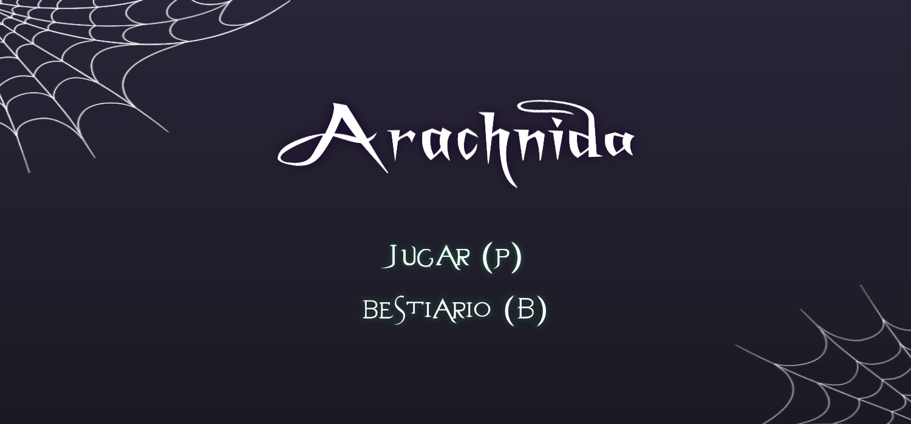
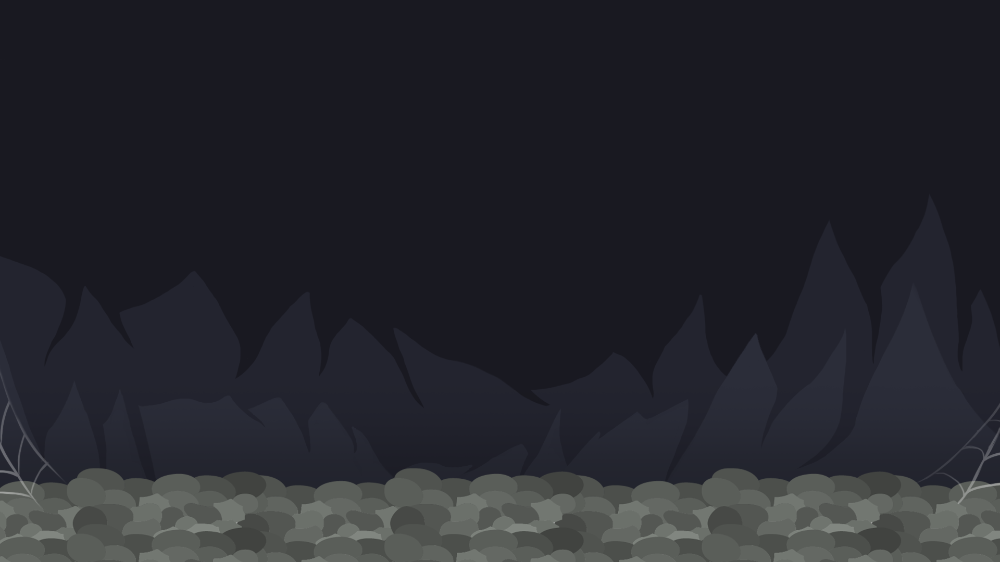
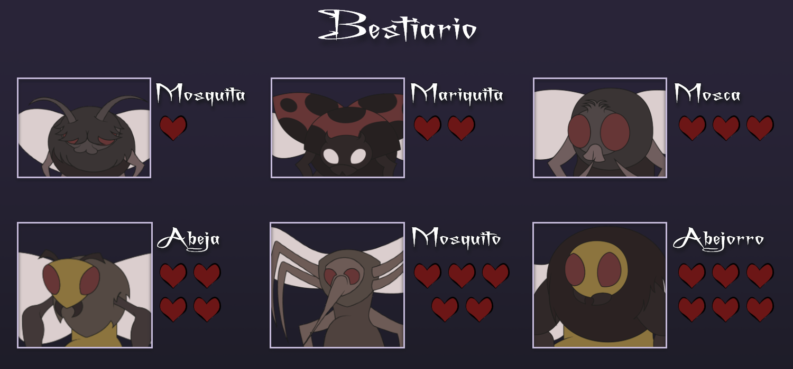

# Arachnida

## Equipo de desarrollo

- Garay Aaron
- Mojsa Ignacio
- Ozore Teodoro
- Pochyly Maitena
- Silva Jorge

## Capturas

    
    
    

## Reglas de Juego / Instrucciones

Arachnida es una araña que ataca otros insectos para comerselos tirándole telarañas. Inicialmente cuenta con 15 disparos, por lo que hay que ser cuidadoso con ellos. Por cada enemigo eliminado exitosamente, la telaraña los envolverá en una cápsula que Arachnida podrá recolectar para recargar de nuevo sus disparos. Si el enemigo no es devorado transcurrido una cierta cantidad de tiempo, desaperece del nivel y se pierde la oportunidad de recargar las telarañas.  

En el juego, vas a tener que dispararle y matar a los enemigos que vayan apareciendo. A medida que transcurre el tiempo, nuevos y distntos oponentes aparecen, mientras que los ya derrotados regresan fortalecidos con el paso de los niveles. Para pasar de nivel, tenes que eliminar cierta cantidad de enemigos ya preestablecida.

## Controles

**Jugar:** P

**Moverse izquierda/dercha:** A, S 

**Disparar:** Barra espaciadora 

**Reiniciar nivel:** R 

## Otros

- UNAHUR - Universidad Nacional de Hurlingham
- Wollok-LSP-IDE v0.5.3
- Node.js v22.21.1 (LTS)
- Una vez terminado, no tenemos problemas en que el repositorio sea público.